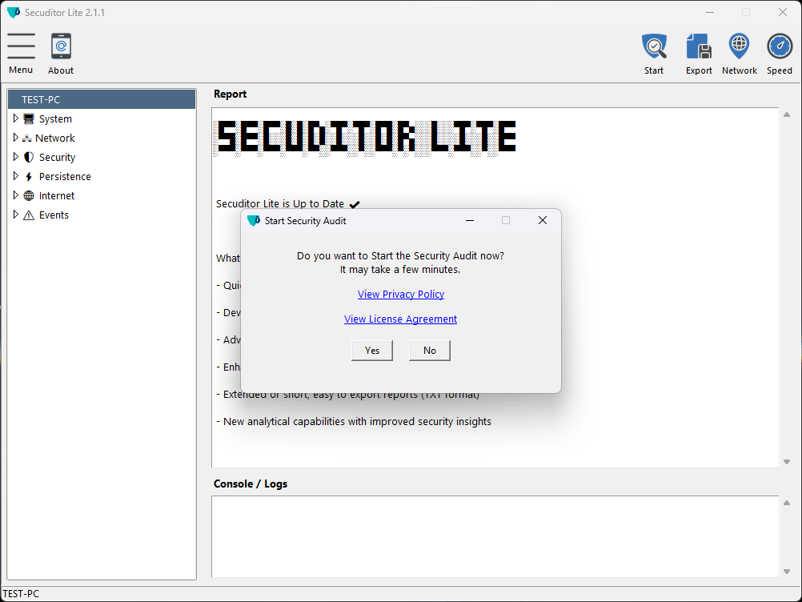
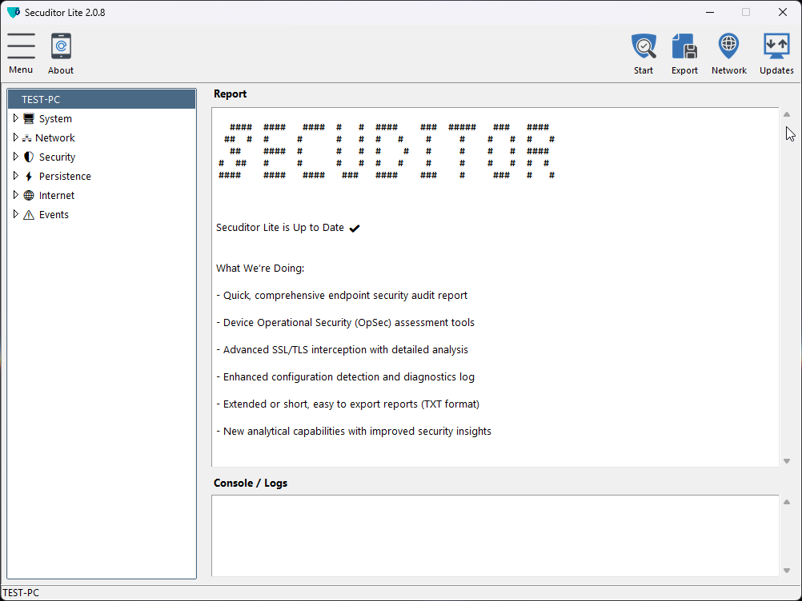

  

 

<a href="#introduction"><b>Introduction</b></a> &nbsp; ✦ &nbsp;
<a href="#presentation"><b>Presentation</b></a> &nbsp; ✦ &nbsp;
<a href="#getting-started"><b>Download</b></a> &nbsp; ✦ &nbsp;
<a href="#safety-notice"><b>Safety Notice</b></a> &nbsp; ✦ &nbsp;
<a href="#privacy-policy"><b>Privacy Policy</b></a> &nbsp; ✦ &nbsp;
<a href="#more-info"><b>More Info</b></a>

---

## Introduction

Secuditor Lite is freeware, Python based diagnostic security tool for Windows endpoints and networks with a friendly GUI. 
It helps identify vulnerabilities, improve device's OpSec, and simplify forensic analysis. Suitable for personal and organizational use.

---
 

## 🛡️ Key Features

- Quick, comprehensive endpoint security audit report
- Device Operational Security (OpSec) assessment tools
- Advanced SSL/TLS interception with detailed analysis
- Enhanced configuration detection and diagnostics log
- Extended or short, easy to export reports (TXT format)
- New analytical capabilities with improved security insights

---
 

## 💿 Standard Edition

Compatible with:
- Windows 10 / 11
- Windows Server 2016 / 2019 / 2022

---
 

## 🎬 Presentation (Windows 11)

### Secuditor running a security audit and displaying reports

 

### Checking device OpSec, VPN status, public IP and geolocation

---
 

## 🚀 Getting Started

### 1️⃣ Download
- #### [SecuditorLite_2.0.8.zip](https://github.com/secuditor/secuditor-lite/releases/download/2.0.8/SecuditorLite_2.0.8.zip)

### 2️⃣ Extract & Run
- Unzip the file
- Double-click **SecuditorLite.exe**
- For all features to work it is recommended to "Run as administrator"

### 3️⃣ Navigation
- Standard mouse left and right clicks
- Keyboard arrow keys for navigating the categories table

---
 

## 🟢 Safety Notice

**Secuditor Lite** is digitally signed and safe for use.
Please ensure that you download the software only from the official source.

Since it is based on Python code, some antivirus programs may incorrectly flag or block its operation.
If you trust this application, you may need to create an **exception**, add it to a **whitelist** or **restore** the file from your antivirus software’s quarantine area.

Microsoft Defender SmartScreen may also display a warning because **Secuditor Lite** is a new, verified application.
When the SmartScreen warning appears:
1. Click **“More info”**  
2. Verify that the **Publisher** is `Menahem Levinski`  
3. Click **“Run anyway”**

---
 

## 📄 Privacy Policy

**Secuditor Lite** is a diagnostic security tool that runs locally on your device.  
It does **not collect, store, or transmit any personal data** or system information without the user’s explicit action or consent.

All analyses and reports are generated and stored locally in the same folder where the software resides.  
No personal information is sent automatically.

The application may periodically communicate with our secure servers to:
- Verify the availability of software updates.
- Retrieve updated security resources, including threat intelligence feeds and reputation databases.
- These connections transmit only non-personal, technical data (e.g., version identifiers or checksum values).

Optional online checks (like public IP lookups or external connection analysis) are performed **only when initiated by the user**.  
All logs and cache generated by the software are stored locally on your device (e.g., in *Documents* or *Cache* folders).

---
 

## 🔒 Why closed source?

The tool is distributed in its complete form as **freeware** to ensure secure design and code integrity, which require a controlled and confidential development environment.

---
 

## 🧩 Shared Scripts

A partial collection of open source Python scripts developed for the Secuditor project is available in the [Secuditor Scripts](https://github.com/secuditor/secuditor-scripts) repository.

---
 

## 🔗 Links and Licenses

- **[Changelog](CHANGELOG.md)**
- **[Code of Conduct](CODE_OF_CONDUCT.md)**
 

- **[Software License](LICENSE.txt)**
- **[Third Party Licenses](THIRD_PARTY_LICENSES.txt)**
 

- **Website:** [secuditor.com](https://secuditor.com)
- **Contact:** info@secuditor.com
- **GitHub:** [github.com/secuditor](https://github.com/secuditor)

---
 

© 2025 Menahem Levinski. All rights reserved.
<a href="#top">🔝</a>

