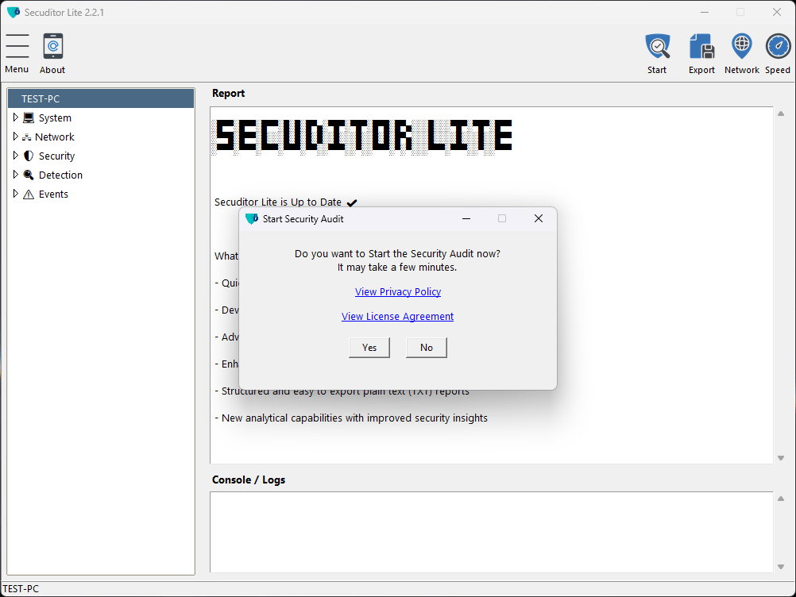

<a name="top"></a>

<div align="center" style="line-height: 0;">
  <a href="https://github.com/secuditor/secuditor-lite">
    
  </a>
</div>

<br>

<div align="center">
<a href="#introduction"><b>Introduction</b></a> &nbsp; ✦ &nbsp;
<a href="#presentation"><b>Presentation</b></a> &nbsp; ✦ &nbsp;
<a href="#getting-started"><b>Download</b></a> &nbsp; ✦ &nbsp;
<a href="#safety-privacy"><b>Safety & Privacy</b></a> &nbsp; ✦ &nbsp;
<a href="#open-scripts"><b>Open Scripts</b></a> &nbsp; ✦ &nbsp;
<a href="#more-info"><b>More Info</b></a>
</div>

---
<br>

<a name="introduction"></a>

# Secuditor Lite – Windows Security Tool

**Secuditor Lite** is a free, Python-based diagnostic security tool for Windows endpoints and networks with a friendly GUI.
It helps identify system vulnerabilities, improve device Operational Security (OPSEC), detect network elements, run internet speed test, and generate structured audit reports, all in one place. Suitable for both personal and organizational environments.

---
<br>

## Key Features

- Quick, comprehensive endpoint security audit report
- Device Operational Security (OPSEC) assessment tools
- Advanced SSL/TLS interception with detailed analysis
- Enhanced configuration check and diagnostic summary
- Extended or short, easy to export reports (TXT format)
- New analytical capabilities with improved security insights

---
<br>

## Security Checks & Diagnostics

**Secuditor Lite** analyzes Windows systems across:

- System overview & hardware analysis
- Network configuration & gateway discovery
- Shared folders & permissions mapping
- Security controls (AV, EDR, Firewall, UAC, and more)
- Remote access & server roles analysis
- Credential integrity & password policies
- Domain settings & user access
- Sensitive data and paths exposure
- Suspicious processes and connections
- SSL interception analysis
- Security event log audit

➡️ See the full Checklist: [Security Checklist](SECURITY_CHECKLIST.md)

---
<br>

## Standard Edition

### Compatible with:
- Windows 10 / 11
- Windows Server 2016 / 2019 / 2022

---
<br>

<a name="presentation"></a>

## Presentation (Windows 11)

### Toolbar buttons (right to left):
- Internet download speed measurement
- Network public IP and geolocation detection
- Export extended security audit report
- Start security audit
- About and contact us
- Menu

*The animation below shows Secuditor Lite application in action*
<p align="center">
  <a>
    
  </a>
</p>

---
<br>

<a name="getting-started"></a>

## Getting Started

### 1️⃣ Download
- #### [SecuditorLite_2.1.5.zip](https://github.com/secuditor/secuditor-lite/releases/download/2.1.5/SecuditorLite_2.1.5.zip)

### 2️⃣ Extract & Run
- Unzip the file
- Double-click **SecuditorLite.exe**
- For all features to work it is recommended to "Run as administrator"

### 3️⃣ Navigation
- Standard mouse left and right clicks
- Keyboard arrow keys for navigating the categories table

---
<br>

<a name="safety-privacy"></a>

## Safety Notice

**Secuditor Lite** is digitally signed and safe for use.
Please ensure that you download the software only from the official source.

Since it is based on Python code, some antivirus programs may incorrectly flag or block its operation.
If you trust this application, you may need to create an **exception**, add it to a **whitelist** or **restore** the file from your antivirus software’s quarantine area.

Microsoft Defender SmartScreen may also display a warning because **Secuditor Lite** is a new, verified application.
When the SmartScreen warning appears:
1. Click **“More info”**  
2. Verify that the **Publisher** is `Menahem Levinski`  
3. Click **“Run anyway”**

---
<br>

## Privacy Policy

**Secuditor Lite** is a diagnostic security tool that runs locally on your device.  
It does **not collect, store, or transmit any personal data** or system information without the user’s explicit action or consent.

All analyses and reports are generated and stored locally in the same folder where the software resides.  
No personal information is sent automatically.

The application may periodically communicate with our secure servers to:
- Verify the availability of software updates.
- Retrieve updated security resources, including threat intelligence feeds and reputation databases.
- These connections transmit only non-personal, technical data (e.g., version identifiers or checksum values).

Optional online checks (like public IP lookups or external connection analysis) are performed **only when initiated by the user**.  
All logs and cache generated by the software are stored locally on your device (e.g., in *Documents* or *Cache* folders).

---
<br>

<a name="open-scripts"></a>

## Open Scripts

A collection of open-source Python modules developed as part of the **Secuditor project** is available in the **[open_scripts](/open-scripts)** folder, licensed under the [MIT License](/open-scripts/LICENSE.txt) (applicable only to this folder).

<br>

The tool **Secuditor Lite** is distributed in its complete form as a closed source freeware to ensure secure design and code integrity which require a controlled and confidential development environment.

---
<br>

<a name="more-info"></a>

## Info, Links and Licenses

- **[Changelog](CHANGELOG.md)**
- **[Contributing](CONTRIBUTING.md)**
- **[Software License](LICENSE.txt)**
- **[Third Party Licenses](THIRD_PARTY_LICENSES.txt)**
<br>

- **Website:** [secuditor.com](https://secuditor.com)
- **Contact:** info@secuditor.com
- **GitHub:** [github.com/secuditor](https://github.com/secuditor)

---
<br>

## 📁 Project Structure

```bash
secuditor-lite/                   # Main project folder
│
├── media_files/                  # Media assets (images, GIFs)
│
├── open_scripts/                 # Open source Python scripts
│
├── CHANGELOG.md                  # Project change log
├── CONTRIBUTING.md               # Contribution guidelines
├── LICENSE.txt                   # License file
├── README.md                     # Project overview
├── SECURITY.md                   # Security policy
├── SECURITY_CHECKLIST.md         # Security Checks & Diagnostics
└── THIRD_PARTY_LICENSES.txt      # Third party licenses
```

---
<br>
<p align="center">
© 2025 Menahem Levinski. All rights reserved.
<a href="#top">🔝</a>
</p>
